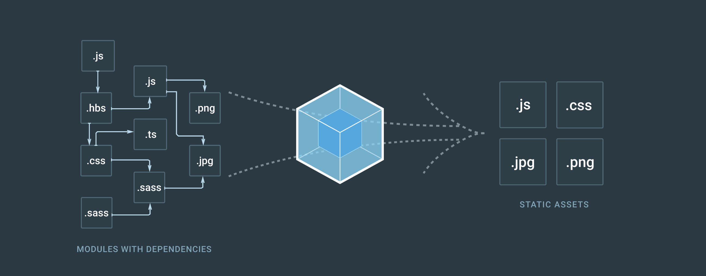

# Modern JavaScript

JavaScript is arguably one of the most important languages today. The rise of the web has taken JavaScript places it was never conceived to be. This document intends to briefly introduces modern JS features while comparing it to the old fashioned way of achieving the same result by writing the examples using ES5 only features side-by-side with new ES2015+ equivalents.

## History

JavaScript was invented by Brendan Eich in 1995 and was first named **Mocha** and released by the name **LiveScript** in conjunction with Netscape browser (Beta). Switched name to **JavaScript** by the end of that same year when Sun and Netscape did a license agreement [[1](#References)].

Was submitted for standardization to the ECMA International and became an ECMA standard in early 1997 and because of trademark reason, the committee was not able to use the JavaScript name, so after some discussions it was decided that the language described by the standard would be called **ECMAScript** [[2](#References)].

ECMA International is an industry association formed in 1961 concerned solely with standardization of information and communications systems [[3](#References)].

The first big changes made since the first ECMA version was released had arrived with _ES3_, shorthand for ECMAScript 3, in december 1999 and brought into play stuffs like _regular expression_, _do-while block_, _exceptions and try/catch blocks_, the _in_ and _instanceof_ operators and more.

The works on ECMAScript 4 begun right after ES3 was released, but, due to strong differences in the committee, ES4 was never released, and util 2009 there were no major releases of a new standard.

The year of 2009 became known as the rebirth of JavaScript. After a long struggle with ES4, the next version was released and ES5 became one of the most supported versions of JavaScript as the compiler target of many transpilers since it's supported by the majority of browser nowadays.

ECMAScript 5 introduced features like [[4](#References)]:

- Getters and Setters
- Trailing commas in array and objects literals
- New Object methods
  - create, defineProperty, keys, seal, freeze, getOwnPropertiesName, etc.
- New Array methods
  - isArray, indexOf, every, some, map, filter, reduce, etc
- New Date methods
  - toISOString, now, toJSON
- Function binding
- JSON
- Immutable global objects
  - undefined, NaN, Infinity
- Strict mode
- JSON support

ECMAScript 6, later renamed to ECMAScript 2015, implemented some of the big features proposed by ECMAScript 4, but with a different mindset. New features were created as syntactic sugar over the existing ones, which eases the transition and development of those new features [[5](#References)].

A short summary of features is described below [[6](#References)]:

- let and const
- Arrow functions
- Classes
- Default parameters
- Array.find and Array.findIndex
- New Number methods
  - isInteger, isSafeInteger
- New Global methods
  - isFinite
  - isNaN
- Template literals
- Promises
- Generators
- Spread syntax
  - At array initializer and argument lists
- Destructuring
- Tail call optimization
- Module system
- New collections
  - Set, Map, WeakSet, WeakMap
- Enhanced Object syntax
  - Property shorthand, computed property names, method properties

From ES6 beyond, the new standard was to release a new ECMAScript version every year, as a consequence, the language became more mature and concise while new features were introduced. By the next year, ECMAScript 2016 (ES7) was released and introduced only two new features:

- Exponential operator `**`
- Array.prototype.includes

ECMAScript 2017 (ES8) was officially released at the end of June that year by TC39 and included:

- Enhanced object properties
  - Object.values(), Object.entries(), Object.getOwnPropertyDescriptors
- String padding
- Async / Await with error handling
- Shared memory and atomics

ECMAScript 2018 (ES9), the last release so far, introduced the following:

- Promise.prototype.finally()
- Asynchronous iteration
- Spread / Rest object properties

## Tools

With the release of ECMAScript 2015, the hype around web development became bigger and more eloquent. A bunch of new tools were, and still, released every day and spread over different domains of computer science. Those tools are responsible for tracking a wide range of issues going from web development to unexplored domains.

### Babel

Babel is a toolchain that is mainly used to convert ECMAScript 2015+ code into backwards compatible version of JavaScript in current and older browsers or environments [[7](#References)]. Includes features like:

- Transform syntax
- Polyfill features that are missing in your target environment
- Source code transformations

```js
// Babel Input: ES2015 arrow function
[1, 2, 3].map(n => n + 1);

// Babel output: ES5 equivalent
[1, 2, 3].map(function(n) {
  return n + 1;
});
```

### Webpack

Webpack is a static module bundler for modern JavaScript applications. When processes an application, it internally builds a dependency graph which maps every module that a specific project needs and generates one or more bundles [[8](#References)].



## Modern features

This chapter will describe, more extensively, modern JavaScript features. It isn't intended to teach JavaScript, but to help developer with basic JS knowledge to get familiar with modern codebase.

### Complementary resources

- [ES6 - JavaScript Improved (Udacity free course)](https://www.udacity.com/course/es6-javascript-improved--ud356#)
- [ES6 features with examples](http://es6-features.org/)
- [Mozila Developer Network](https://developer.mozilla.org/en-US/search?q=)
- [Getify - You don't know JS (Book series)](https://github.com/getify/You-Dont-Know-JS)

### Variable declaration

There are three ways of declaring a variable, each having different implications. Those are `var`, `let` and `const`. With the two lasting ones being block scoped and var being function scoped. The scope of a variable roughly means "where is this variable available in the code".

#### `const`

Variable declared with `const` keyword are block scoped and can't be reassigned. Notice that it's not to be confused with immutability since its concern does not involve granting immutability, it only prevents it from being reassigned.

```js
const foo = { bar: "baz" };

// Will throw TypeError: invalid assignment to const 'foo'
foo = { bar: "qux", baz: "quux" };

foo.bar = "qux";
foo.baz = "quux";

console.log(foo);
// foo now contains { bar: 'qux', baz: 'quux' }
```

#### `let`

Also block scoped, when declared with let, variable can be reassigned as many times as required.

```js
let foo = "bar";
foo = "baz";
console.log(foo);

// "baz", reassignment is allowed with let
```

#### `var`

Are function scoped, meaning that whenever a `var` variable is created inside a function, it's available throughout the entire function life cycle.

```js
function myFunction() {
    if (true) {
        var myVar = "foo";
    }


    console.log(var); // "foo"
}

console.log(myVar); // Throws an ReferenceError
```

Besides that, when using `var` declared variables, they are moved to the top of its scope when being compiled. This is called **var hoisting** and allows variables to appear to be used before it's declared [[9](#References)].

```js
function myFunction() {
  console.log(bar); // undefined
  var bar = 111;
  console.log(bar); // 111
}

// Implicitly understood as:
function myFunction() {
  var bar;
  console.log(bar); // undefined
  bar = 111;
  console.log(bar); // 111
}
```

#### Variable scope

As mentioned above, `var` variables are function scoped. On the other hand `const` and `let` are block scoped, so are not accessible before defined and can't be re-declared in the same scope.

```js
console.log(foo); // Raises ReferenceError
const foo = "bar";

function myFunction() {
  let baz = "baz"; // Scoped by myFunction

  // Here, the block scope of baz is the if {}
  if (true) {
    let baz = "qux";
    console.log(baz); // qux
  }

  console.log(baz); // baz
}

let myVar = 2;
let myVar = 3; // Raises SyntaxError
```

### Arrow function

Introduced as another way of declaring and using functions in a more concise way and having implicit return capabilities.

```js
function max(a, b) {
  return a > b ? a : b;
} // Traditionally
const max = (a, b) => (a > b ? a : b);
```

If your function only takes one parameter, you can omit the parentheses around it.

```js
const double = x => x * 2;
```

Arrow functions **are only implicitly return when the brackets are omitted**, that being said, the following won't return if not explicitly required;

```js
const double = x => {
  x ** 2;
  // return x ** 2;
};
```

### Default Parameter

Allows function parameter to be initialized with a default value if no value or `undefined` is provided. In the past, the general strategy for setting defaults was to test parameter values in the function body and assign a value if they are undefined [[10](#References)].

```js
// Traditionally
function myFunction(x) {
  if (typeof x === "undefined") {
    x = "defaultValue";
  }

  // Logic goes here
}

//ES2015+
const myFunction = (x = "defaultValue") => {
  // Logic goes here
};
```

### Destructuring

It's a convenient way of creating new variables by unpacking values from Arrays and properties from Objects.

#### Array examples

```js
const [first, second] = [0, 1];
const [first, second = 1] = [0]; // Allows default values
```

Which could be manually achieved by index accessing the array and assigned to a new variable.

```js
var first = arr[0];
var second = arr[1] || 1; // With default value as well
```

#### Object examples

```js
const { foo } = { foo: 'bar' };
const { foo = 'bar' } = {}; // Allows default values
const { foo: aliased_var } = { foo: 'bar' }; Allows aliasing
const { foo: { bar } } = { foo: { bar: 'baz' } }; // Allows nested extraction
```

### Array methods

Beyond ECMAScript 6, new array methods were introduced and made JS feels more functional than ever. Next, you'll see how to use them.

#### Array.from(arrayLike, mapFunc?, thisArg?)

A static method intended to convert two kinds of objects into an array:

##### Array-like

An object that has a property `length` and indexed elements.

##### Iterable values

Collections of elements that can be retrieved one element at a time. Examples of iterables are `Array`, `String` and new ECMAScript's `Map` and `Set`.

```js
const arrayLike = { length: 2, 0: "a", 1: "b" };

Array.from(arrayLike);
// Outputs: Array [ "a", "b" ]
```

You could also provide a mapping function in order to produce a different output.

```js
Array.from([1, 2, 3], x => x * x);
// Outputs: Array(3) [ 1, 4, 9 ]
```

#### Array.of(element0[, element1[, ...[, elementN]]])

Creates a new `Array` instance from a variable number of arguments.

```js
Array.of(7); // [7]
Array.of(1, 2, 3); // [1, 2, 3]
```

#### Array.prototype.map(callback)

Iterates over its elements applying some logic defined by `callback` witch in turns receives the current value and is responsible for returning something. As a result, it'll return a new array with those values returned by `callback`.

```js
const array = [1, 2, 3];

array.map(x => x * 2); // [2, 4, 6]
```

The mapping callback function can be expressed, verbosely, by:

```js
function callback(currentValue[, index[, array]]) {
  // Return element
}
```

#### Array.prototype.filter(callback)

Produces a new array, with filtered elements, by applying a function over itself. Each element will be included in the new array if the filtering `callback` returns `true` when receives the current element as an argument.

```js
const array = [1, 2, 3, 4];

function isEven(number) {
  return number % 2 === 0;
}

array.filter(isEven); // [2, 4]
```

As with **map**, the callback function can be defined as:

```js
function callback(currentValue[, index[, array]]) {
  // Return element
}
```

#### Array.prototype.reduce(callback[, accumulator)

Executes a **reducer** function on each member of the array resulting in a single output value. The returned reducer value will be used in the next reducer call as first argument `accumulator`. The initial `accumulator` is defined by the second argument passed to `reduce`, or, if not supplied, it will use array's first element.

```js
const array = [1, 2, 3, 4];

function reducer(accumulator, currentValue) {
  return accumulator + currentValue;
}

array.reduce(reducer);
// Expected output: 10
```

#### Array.prototype.find(callback)

Returns the first element for which the `callback` returns `true` or `undefined` if none was found.

```js
[6, -5, 8].find(x => x < 0);
// Outputs -5

[(6, 5, 8)].find(x => x < 0);
// Outputs undefined
```

#### Array.prototype.findIndex(callback)

Returns the index of the first element for which the `callback` returns `true`. If the is no match, it'll return -1.

```js
[6, -5, 8].findIndex(x => x < 0);
// Outputs 1
[6, 5, 8].findIndex(x => x < 0);
// Outputs -1
```

The full signature of the `callback` is:

```js
function callback(element, index, array)
```

#### Array.prototype.every(callback)

Tests whether all elements in the array satisfied the `callback` condition.

```js
function isBelowThreshold(currentValue) {
  return currentValue < 40;
}

const array = [1, 30, 39, 29, 10, 13];

array.every(isBelowThreshold);
// Outputs `true`
```

The full signature of the `callback` is:

```js
function callback(element, index, array)
```

#### Array.prototype.some()

Tests whether at least one element in the array satisfied the `callback` condition.

```js
const array = [1, 2, 3, 4, 5];

function isEven(element) {
  return element % 2 === 0;
}

array.some(even);
// Outputs `true`
```

The full signature of the `callback` is:

```js
function callback(element, index, array)
```

### Spread Operator

The spread operator `...` has been introduced with ES2015 and allows iterables (array like) to be expanded into places where multiple elements are expected or an object expression to be expanded in places where zero or more key-value pair can fit.

##### Array like example

```js
const array = ["a", "b", "c"];
const spreaded = [...array, "d", "e", "f"]; // ["a", "b", "c", "d", "e", "f"]
```

#### Function arguments example

```js
function myFunc(x, y, ...otherParams) {
  /**
   * x here represents the first argument
   * y here represents the second argument
   * otherParams will enclosure any other arguments in an array
   */
}

myFunc("a", "b", "c", "d", "e", "f");
// "a"
// "b"
// ["c", "d", "e", "f"]
```

### Object property shorthand

### Promises

### Template literals

### Module system

#### Named export

#### Default export

### Classes

#### extends

#### super()

### Async / await

### Generators

### Static methods

## References

[1] "Netscape and Sun announce JavaScript", PR Newswire, December 4, 1995. Available at [web archive](https://web.archive.org/web/20070916144913/http://wp.netscape.com/newsref/pr/newsrelease67.html).

[2] JavaScript Versions, W3Schools. Available at [w3schools](https://www.w3schools.com/js/js_versions.asp).

[3] ECMA International home page. Available at [ECMA Homepage](https://www.ecma-international.org/).

[4] ECMAScript 5 Features. Available at [w3schools](https://www.w3schools.com/js/js_es5.asp).

[5] ECMAScript 2015 support in Mozilla. Available at [mozilla](https://developer.mozilla.org/en-US/docs/Web/JavaScript/New_in_JavaScript/ECMAScript_2015_support_in_Mozilla).

[6] ECMAScript® 2015 Language Specification. Available at [ECMA international](http://www.ecma-international.org/ecma-262/6.0/index.html).

[7] What is Babel?. Available at [Babel docs](https://babeljs.io/docs).

[8] Webpack concepts. Available at [Webpack docs](https://webpack.js.org/concepts).

[9] var hoisting. Available at [MDN](https://developer.mozilla.org/en-US/docs/Web/JavaScript/Reference/Statements/var#var_hoisting).

[10] Default parameters. Available at [MDN](https://developer.mozilla.org/en-US/docs/Web/JavaScript/Reference/Functions/Default_parameters).
